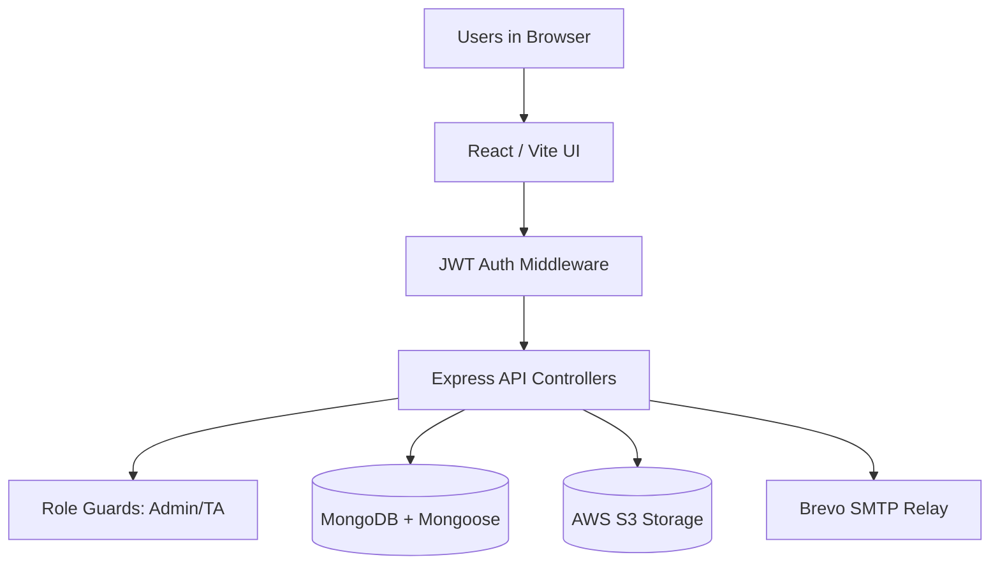

# The Online Kuppiya


The Online Kuppiya is a production-grade, modern Q&A forum and academic knowledge-sharing platform tailored for university students and educators.

It brings together:
- peer-to-peer academic support and discussion threads,
- gamified reputation and achievement systems,
- instructor-verified answer workflows (TA Dashboard),
- secure user authentication and institutional access control,
- rich media support via AWS S3,
- and an administrative command center for moderation.

Built and engineered by Navodhya Fernando.

## Features

- Secure JWT authentication with email verification and password reset workflows
- Advanced Q&A capabilities: rich text formatting, tagging, upvoting/downvoting, and accepted answers
- **Gamification Engine:** Dynamic scholar levels (Novice to Legend), reputation points, credit economy, and unlockable achievement badges
- **Academic Verification:** Dedicated TA/Instructor roles capable of marking answers as "Instructor Verified"
- Custom user profiles with dynamic avatars, academic context, and activity heatmaps
- Secure cloud storage integration with AWS S3 for attachments and media
- Automated transactional emails via Brevo SMTP
- Admin console for:
  - user approvals and role management,
  - content moderation and queue intervention,
  - global system metrics and platform health

## Benefits

- Centralized institutional knowledge: prevents duplicate questions and lost insights
- Higher student engagement: gamified incentives encourage active participation and high-quality answers
- Trust and accuracy: TA verification ensures students can confidently rely on correct information
- Modern UX: cinematic animations, dark mode preferences, and sticky-scroll architecture reduce cognitive load
- Scalable architecture: built with a robust MERN stack and secure cloud-native integrations
- Production-ready posture: strict CORS policies, error tracking, and environment-driven configurations

## Tech Stack

- Frontend: React 18, Vite, React Router DOM
- UI System: Tailwind CSS, custom premium CSS architecture, and Lucide React icons
- Backend: Node.js, Express.js REST API
- Authentication: JSON Web Tokens (JWT) with HTTP-only cookies/headers
- Data Layer: MongoDB with Mongoose ODM
- Cloud Storage: AWS S3 with pre-signed URLs
- Email Integration: Brevo SMTP support for transactional workflows

## Why This Project Reflects My Engineering Profile

- Full-stack ownership from modern UI/UX design to robust backend architecture
- Complex relational data modeling within a NoSQL environment (Users, Questions, Answers, Votes)
- Implementation of real-world operational workflows (Gamification logic, TA verification pipelines)
- Security-first approach: environment variables, password hashing, and role-based access control (RBAC)
- Clean separation of concerns across controllers, routes, middleware, and API services

## System Architecture

### Architecture Components (with logos)




### How Data Flows (simple view)

1. Users interact with the React frontend.
2. Auth middleware protects private routes using JWT tokens before requests proceed.
3. Express API controllers handle business logic (posting questions, voting, verifying).
4. Role guards enforce who can access specific actions (e.g., only TAs can verify answers).
5. MongoDB stores persistent business data (users, reputation, posts).
6. Media uploads bypass the database and stream directly to AWS S3.
7. Brevo integration dispatches transactional emails (verifications, resets).

## Repository Structure

```text
The-Online-Kuppiya/
  frontend/
    src/
      api/
      components/
      contexts/
      pages/
  backend/
    controllers/
    middleware/
    models/
    routes/
    services/
  .env
```

## Quick Start

### Prerequisites

* Node.js 18+
* npm 9+
* MongoDB connection string (Atlas or Local)
* AWS S3 Bucket credentials

### Environment Variables

```env
PORT=3003
MONGO_URI=mongodb+srv://<username>:<password>@<cluster>/<db>?retryWrites=true&w=majority
JWT_SECRET=<strong-random-secret>
FRONTEND_URL=https://online-kuppiya.vercel.app
APP_URL=https://online-kuppiya.vercel.app
CORS_ORIGIN=https://online-kuppiya.vercel.app
```

### Install and Run (Development)

```bash
npm install
npm run dev
```

### Build and Production Run

```bash
npm run build
node backend/server.js
```

## Key Application Areas

* Forum Dashboard
* Q&A Threads
* User Profiles
* Settings
* Admin Command Center
* Authentication Gateway

## Security and Access Notes

* Protected API routes are guarded by strict JWT middleware.
* Privileged actions enforce server-side role checks.
* Passwords are encrypted via bcrypt before database insertion.
* CORS is restricted to defined origins.

## License

This project is proprietary software.

Copyright © 2026 Navodhya Fernando. All Rights Reserved.

No permission is granted to use, copy, modify, distribute, or commercialize any part of this project without prior written authorization from the copyright owner.
